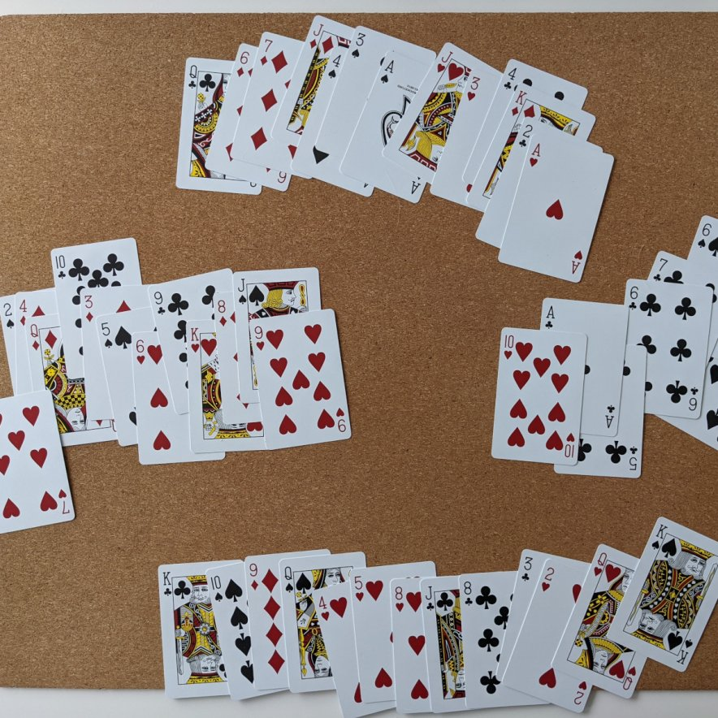
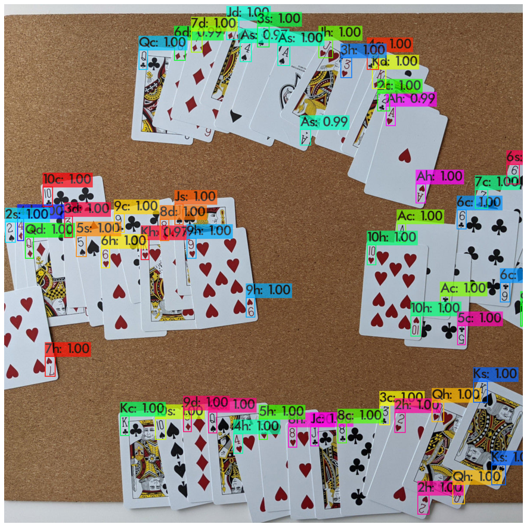

# bidly - Bridge Hand Recognizer and Solver
This project consists of three parts:
- training data generation
- detector
- solver

## Training Data
| | Example |
|---|---|
|Original||
|Convex hull||
|Minor differences in warmth & brightness etc.|  |
|Final synthesized photo|  |

## Detector
| | Example |
|---|---|
|Original ||
|Detection ||

## Solver
